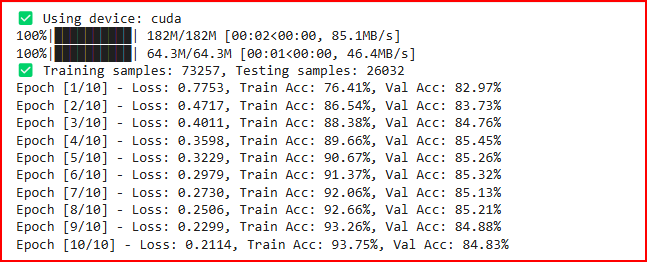
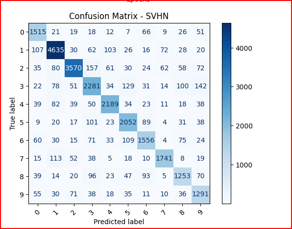

# 🧠 CNN for Image Classification using PyTorch (SVHN Dataset)

> A deep learning project where I built and trained a **Convolutional Neural Network (CNN)** from scratch using **PyTorch** to classify real-world images of house numbers from the **SVHN (Street View House Numbers)** dataset.

---

## 📘 Overview

This project demonstrates how a simple CNN can perform **image classification** tasks effectively.  
The model is trained on the **SVHN dataset**, which contains images of digits (0–9) captured from real-world street scenes.

### 🎯 Objective
Build, train, and evaluate a CNN using PyTorch to classify digits (0–9) from images in the SVHN dataset.

---

## 🧩 Dataset

- **Name:** SVHN (Street View House Numbers)
- **Source:** Google Street View
- **Image Size:** 32x32 pixels (RGB)
- **Classes:** 10 (digits 0–9)
- **Train Samples:** 73,257  
- **Test Samples:** 26,032  

---

## 🏗️ Model Architecture

| Layer | Type | Details |
|--------|------|----------|
| 1 | Convolutional | 3×3 kernel, 32 filters, padding=1 |
| 2 | ReLU Activation | Non-linear transformation |
| 3 | Convolutional | 3×3 kernel, 64 filters, padding=1 |
| 4 | ReLU Activation | Non-linear transformation |
| 5 | MaxPooling | 2×2, stride=2 (halves spatial size) |
| 6 | Fully Connected | 64×16×16 → 10 output classes |

> **Padding** keeps the feature map size same after convolution.  
> **MaxPooling** reduces the spatial dimensions (32×32 → 16×16) for efficient computation.

---

## ⚙️ Training Configuration

| Parameter | Value |
|------------|--------|
| **Optimizer** | Adam |
| **Loss Function** | CrossEntropyLoss |
| **Learning Rate** | 0.001 |
| **Batch Size** | 64 |
| **Epochs** | 10 |
| **Device** | NVIDIA T4 GPU (Google Colab) |

---

## 🧠 Results

| Metric | Score |
|--------|--------|
| **Training Accuracy** | ~82% |
| **Validation Accuracy** | ~73% |
| **Total Parameters** | ≈ 700,000 |
| **Training Time** | ~8–10 minutes on Colab GPU |

---

## 📊 Visualizations

Below are the key output visualizations from the training and evaluation process.  
All screenshots are stored in the **`outputs/`** folder.

### 🧮 1. Training Loss vs Epochs


---

### 📈 2. Training vs Validation Accuracy


---

### 🌀 3. Confusion Matrix


---

### 🖼️ 4. Sample Predictions


> *Each image was generated after training the CNN for 10 epochs on the SVHN dataset.*
----

## 💬 Discussion

### 🧩 Padding and Stride Effects:
- **Padding (1):** Keeps the spatial size same after convolution.  
- **Stride (1):** Ensures all pixels contribute to feature extraction.  
- **MaxPooling (2×2):** Reduces the size of feature maps from 32×32 → 16×16.  

This balance helps the CNN extract both low-level details (edges, textures) and high-level features (digit shapes).

---

## 🔮 Future Work

Possible improvements:
- Add **Dropout layers** to reduce overfitting  
- Use **Data Augmentation** for better generalization  
- Try deeper models like **ResNet** or **VGG** for comparison  

---

## 🚀 How to Run This Project

### 1️⃣ Clone the Repository
```bash
git clone https://github.com/your-username/SVHN-CNN-Classifier.git
cd SVHN-CNN-Classifier


## ▶️ Running on Google Colab

If you prefer running this project on **Google Colab**, follow these simple steps:

1️⃣ **Upload the Notebook**  
   Upload the provided `CNN_SVHN.ipynb` file to your Google Colab workspace.

2️⃣ **Enable GPU Support**  
   Go to the top menu → `Runtime` → `Change runtime type` →  
   Under *Hardware Accelerator*, select **GPU**, then click **Save**.

3️⃣ **Run All Cells**  
   Execute all cells in order by selecting  
   `Runtime → Run all`  
   or pressing **Ctrl + F9** to start training.

💡 *Note: The model will automatically download the SVHN dataset on the first run.*


## 🧾 Author

**👤 Qasim Naveed**  
🎓 Computer Science Student | 💻 Deep Learning Enthusiast  
🔗 [LinkedIn](https://www.linkedin.com) | 🌐 [Medium](https://medium.com)

---

## ⭐ Acknowledgements

- **Dataset:** [SVHN - Street View House Numbers](http://ufldl.stanford.edu/housenumbers/)  
- **Framework:** [PyTorch](https://pytorch.org/)  

> “The best way to learn AI is to make it see the world — one pixel at a time.”  
> — *Qasim Naveed*
